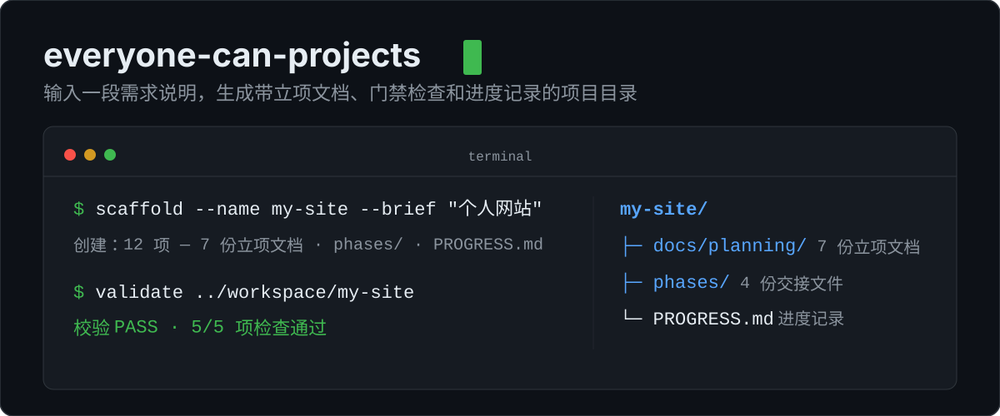

# everyone-can-projects

<p align="center">
  
</p>

<p align="center">
  <a href="https://github.com/ivercurry99/everyone-can-projects/actions/workflows/ci.yml"></a>
  
  
  
</p>

输入一段需求说明，得到一套带立项文档、门禁检查和进度记录的项目目录。可以作为技能装进编程助手，也可以直接在命令行运行；脚本只依赖 Python 标准库。

## 实际运行效果

```text
$ python scripts/scaffold_project.py scaffold --name my-site \
    --brief "做个人网站，作为别人了解我的入口" \
    --modules "文章列表,生活记录,社交按钮" --output ../workspace

创建：12 项
  + docs/planning/01-project-charter.md      立项说明
  + docs/planning/02-feature-list.md         功能清单
  + docs/planning/03-project-dossier.md      项目管理档案
  + docs/planning/04-roadmap.md              推进计划
  + docs/planning/05-tech-stack.md           技术栈选型
  + docs/planning/06-architecture.md         项目架构
  + docs/planning/07-engineering-norms.md    工程规范
  + phases/01-design.md                      架构师交接
  + phases/02-impl.md                        开发者交接
  + phases/03-test.md                        测试员交接
  + phases/04-review.md                      审查员交接
  + PROGRESS.md                              进度记录

$ python scripts/scaffold_project.py validate ../workspace/my-site

校验 → PASS
  ✅ 7 份立项文档齐全 — OK
  ✅ phases/ 交接文件齐全 — OK
  ✅ PROGRESS.md 存在（记忆兜底）
  ✅ PROGRESS.md 含续做锚点 — 含
```

重复运行 scaffold 不会覆盖已有文件，只补缺失项；需要覆盖时显式加 `--force`。

## 为什么需要它

用 AI 做项目常见三类问题，每类对应一个机制：

| 问题 | 对应机制 |
|---|---|
| 需求没说清就开始写代码，越写越偏 | 立项阶段先产出 7 份文档；信息不全时用默认值补齐并说明假设，不反复追问 |
| AI 自己写的代码自己测，问题发现不了 | 五个角色分开：架构师 / 开发者 / 测试员 / 审查员 / 调度员，测试员不兼开发者 |
| 换个会话就忘了之前做到哪 | 进度写入 PROGRESS.md，任何会话先读这个文件再继续，不依赖聊天记录 |

## 工作方式

立项 → 骨架 → 迭代。每个功能过五道门禁：

| 闸 | 谁查 | 查什么 |
|---|---|---|
| Gate 0 | 架构师 | 需求说清楚了吗？有明确的完成标准吗？ |
| Gate 1 | 调度员 | 设计文档完整吗？ |
| Gate 2 | 开发者 | 代码可运行？smoke case 跑过了？ |
| Gate 3 | 测试员（≠ 开发者） | 测试全过？覆盖主路径 + 至少 2 条边界？ |
| Gate 4 | 审查员（≠ 架构师） | 架构合规？文案无 AI 模板痕迹？ |

调度员在 `phases/` 末尾签字，签完才能进入下一个功能。每次只做一个功能，做完一个再下一个。

## 使用

### 方式 A · 命令行（不需要 Agent）

```bash
git clone https://github.com/ivercurry99/everyone-can-projects.git
cd everyone-can-projects
python scripts/scaffold_project.py scaffold \
  --name "my-personal-site" \
  --brief "做个人网站，作为别人了解我的入口" \
  --modules "文章列表, 生活记录, 社交按钮" \
  --output ../workspace
python scripts/scaffold_project.py validate ../workspace/my-personal-site
```

### 方式 B · 装进编程助手

```text
帮我安装「https://github.com/ivercurry99/everyone-can-projects」这个技能。
```

### 方式 C · 不装技能

把 [SKILL.md](./SKILL.md) 交给任意支持读文件的 Agent，按文档执行即可。

## 多模型 / 多 Agent

核心流程只依赖读写文件、提问、执行命令。其余能力缺失时按等价方案降级，不卡死：

| 缺少的能力 | 降级方案 |
|---|---|
| 子智能体 | 单人按角色串行切换，门禁一项不少 |
| 宿主记忆系统 | 用 PROGRESS.md 作为唯一事实来源 |
| superpowers 头脑风暴技能 | 等价的开放式提问 |
| 去 AI 味技能 | 按 6 项 checklist 逐条人工检查 |
| 联网能力 | 跳过 GitHub 开源复用，按本地常识选型 |

完整适配矩阵与常见故障修复见 [references/model-agent-matrix.md](references/model-agent-matrix.md)，降级细节见 [references/fallback-strategy.md](references/fallback-strategy.md)。

## 测试与 CI

36 个单元测试，覆盖率 94%。CI 在 Python 3.10 / 3.11 / 3.12 上运行，覆盖语法检查、脚手架冒烟、幂等性检查和覆盖率门槛，守住 9 条回归红线（R1~R9）：

```bash
pip install -r requirements.txt   # 只有 pytest + pytest-cov
pytest tests/ -v --cov=scripts --cov-fail-under=70
```

## 文档索引

| 文档 | 内容 |
|---|---|
| [SKILL.md](./SKILL.md) | 技能本体：定位、流程、鲁棒性规则 |
| [references/harness.md](references/harness.md) | 五角色 / 五道门禁 / 文件交接 / 发版评审 |
| [references/memory.md](references/memory.md) | 进度记忆纪律：同步、恢复、压缩 |
| [references/development-principles.md](references/development-principles.md) | 开发思维：开源复用、版本管理、部署 |
| [references/fallback-strategy.md](references/fallback-strategy.md) | 能力降级策略与去 AI 味 checklist |
| [references/prompt-engineering.md](references/prompt-engineering.md) | 各阶段结构化 Prompt 模板 |
| [references/model-agent-matrix.md](references/model-agent-matrix.md) | 模型档位适配矩阵 + 回归红线 + 故障修复 |
| [evals/evals.json](evals/evals.json) | 4 条核心评估用例 |

## License

[MIT](./LICENSE) © ivercurry99
